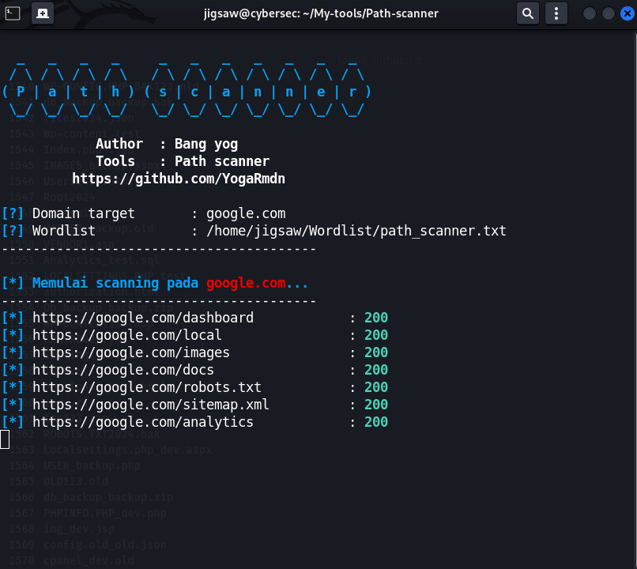

# Path Scanner
[](LICENSE) 
[]

Path Scanner is a simple Python-based tool used to perform brute-force directory and file scanning on target websites.

This tool is suitable for pentesting and bug hunting, with User-Agent randomizer support for a more natural scanning experience.

---

## Features
- Scan hidden directories and files on websites using wordlists
- Domain validation (check DNS and HTTP before scanning)
- User-Agent randomizer support (Chrome, Firefox, Safari, Linux, iPhone)
- Color display (for better visualization)
- Error handling if the wordlist/domain is invalid
- Loop scanning can be performed repeatedly without restarting the tool

---

## How to use the tool

Clone this repo:
```bash
git clone https://github.com/username/path-scanner.git
cd path-scanner
python scan.py
```

